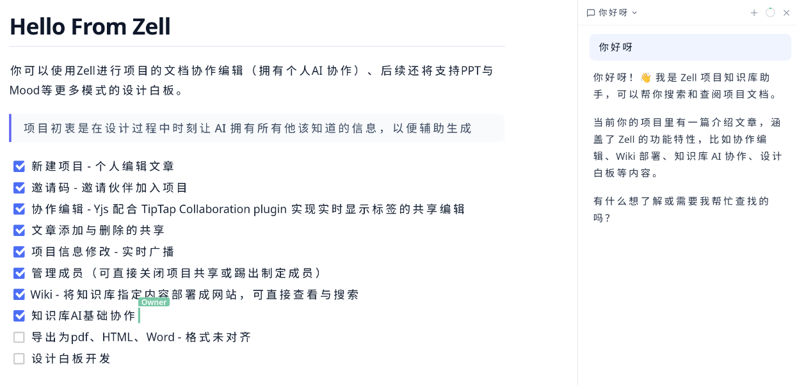

# Zell

> 开源设计协作平台 — 文档、画布、演示，自托管，实时协同。

Zell 将文档编辑、设计画布和演示文稿整合在同一个工作空间中。所有数据本地存储，启动内置服务器即可在团队内实时协作。正在陆续开发 PPT 编辑器、Mood 创意画布和 UI 设计模块。

---

## 功能


### 文档协作
所见即所得的 Markdown 编辑器，支持表格、任务列表、代码块、数学公式。全文搜索，一键导出 PDF/DOCX/HTML。自托管服务器 + 邀请码，团队成员可实时协同编辑同一篇文档。

### Wiki 发布
选中文档一键发布为网页，适合用作团队知识库或个人博客。

### 外部资源
管理链接和本地文件（PDF、Word、图片），自动提取 PDF 文本。(开发中...)

### AI 助手
接入 OpenAI 兼容 API（DeepSeek、Ollama 等），AI 可搜索你的知识库、读取文档内容、辅助写作。

### 设计画布（开发中）
- **PPT** — 自研幻灯片编辑器，可发布为网页预览
- **Mood** — AI 创意画布，用于头脑风暴、AIGC 工作
- **UI** — 原型设计工具

---

## 使用方式
软件分为前端和服务端即支持自托管部署, 软件可跨平台运行(MacOS需自行打包), 服务端也跨平台(Go Server)

1. [Releases](https://github.com/liangruogu/zell/releases) 下载对应平台的客户端与server可执行文件 
2. 在服务器上运行server可执行文件并`复制密钥`
3. 新建项目后在首页的项目服务器配置密钥栏里输入密钥并点击开始共享
4. 复制生成好的邀请码
5. 另一个客户端（其他成员）点击`加入项目`输入：
    - 服务器ip与端口（一般是3000端口，需开放端口）
    - 项目的邀请码
    - 你想要的名字（不可重复）
    - 无法重复加入项目

## 从源码构建
前端
```bash
git clone https://github.com/liangruogu/zell.git
cd zell/app && pnpm install && pnpm tauri dev
```

后端共享服务
```bash
cd server && go mod tidy && go build -o zell-server
./zell-server   # 控制台输出服务器密钥
```

---

## 运行测试

### 前端单元测试（Vitest）

```bash
cd app && pnpm test              # 运行全部 291 个测试
cd app && pnpm test -- --reporter=verbose
```

### Rust 后端测试

```bash
cd app/src-tauri && cargo test    # ~51 个测试
```

### Go 协作服务器测试

```bash
cd server && go test ./...        # ~145 个测试
```

### CI 自动运行

`.github/workflows/test.yml` 在每次 push/PR 时自动运行 L1-L3。

---

## 技术栈

Tauri 2.x / React 19 / TypeScript / Tailwind CSS / TipTap (ProseMirror) / Yjs + y-websocket / Go + Gin / SQLite

## License

MIT
